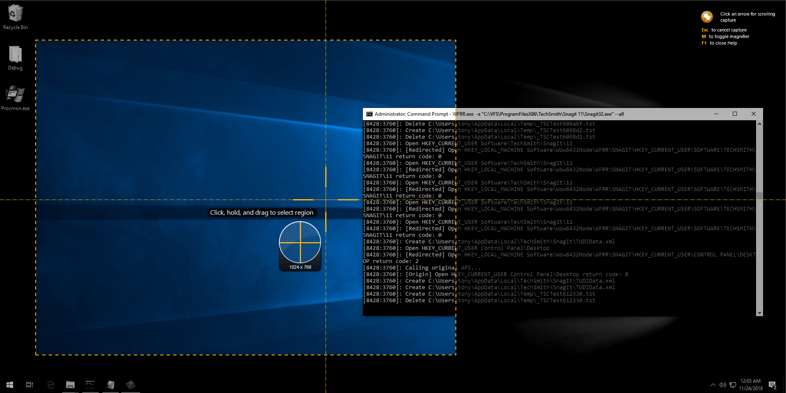

# Windows File/Registry Redirection
[](https://github.com/peitaosu/Win-FS-Reg-Redirect/blob/master/LICENSE)


This project is supposed to redirect all file/registry calls of process to seperated file system/registry location.



## Requirements
- WFRR.exe
   * EasyHook 
   * Newtonsoft.Json
   * log4net

   To update dependencies, use nuget to download packages and copy binaries to 3rdparty folder.
   ```
   nuget install .\BuildCfg\Packages.config -OutputDirectory packages
   ```
- Reg2JSON.py
   * python 2.x

## Supported APIs
* RegOpenKey(Ex)
* RegCreateKey(Ex)
* RegDeleteKey(Ex)
* CreateFileW
* DeleteFileW
* CopyFileW

## Build
* .NET 4.5.2+/VS2015+
    ```
    # In MSBuild Command Prompt for VS2015/VS2017 #
    
    >.\Build.bat
    ```

## V_REG.json Sample
* Source: source registry path.
* Destination: target registry path which you want to redirect to.
```
{
    "Mapping": [
        {
            "Source": "",
            "Destination": ""
        },
        {
            "Source": "",
            "Destination": ""
        }
    ],
    "VRegRedirected": ""
}
```

## V_FS.json Sample
* Source: source directory path.
* Destination: target directory path which you want to redirect to.
```
{
    "Mapping": [
        {
            "Source": "",
            "Destination": ""
        },
        {
            "Source": "",
            "Destination": ""
        }
    ]
}
```


## Usage

Please put `V_REG.json` and `V_FS.json` in the same location as WFRR.exe.

```
Usage: WFRR.exe [OPTIONS]

Options:
  -e, --exe=VALUE            the executable file to launch and inject.
  -a, --arg=VALUE            the arguments of executable file to launch and
                               inject.
  -n, --pname=VALUE          the name of process want to inject.
  -i, --pid=VALUE            the id of process want to inject.
      --all                  inject file hook and registry hook.
      --file                 inject file hook only.
      --reg                  inject registry hook only.
  -b, --bg                   runs in background.
      --no-console-log       disable console logging.
      --no-file-log          disable file logging.
  -h, --help                 show help messages.
```

## Logs

Log file `WFRR.log` will be generated in same location of WFRR.exe and will be useful if you encounter issues.

## How To Debug

Current supported Hooks may be not covered all File System/Registry operations. You probably need to implement additional hooks to cover them.
To know which API calls haven't be hooked, process monitor is your good friend to monitor program operations.

## Windows 7 Support

The pre-compiled binaries were built and tested on Windows 10. If you want to use this software on Windows 7, it would be better to sync code and build binaries on Windows 7 instead of using pre-compiled binaries. This will avoid some issues.
